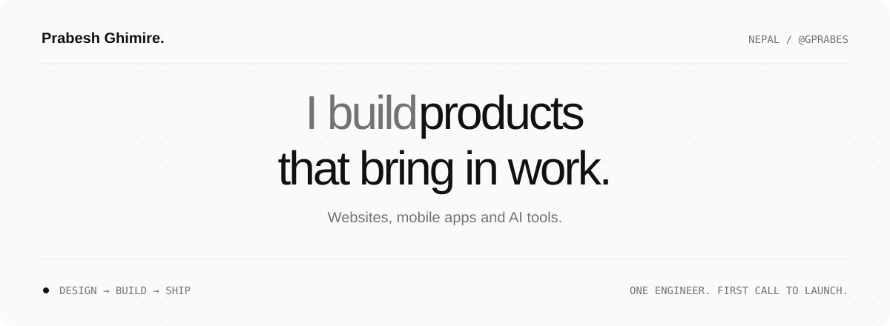

<a href="https://prabeshghimire.com.np">
  <picture>
    <source media="(prefers-color-scheme: dark)" srcset="./assets/profile-dark.svg" />
    <source media="(prefers-color-scheme: light)" srcset="./assets/profile-light.svg" />
    
  </picture>
</a>

  <a href="https://prabeshghimire.com.np"><b>Portfolio ↗</b></a>&nbsp;&nbsp; / &nbsp;&nbsp;
  <a href="mailto:erimihghsebarp@gmail.com">Email</a>&nbsp;&nbsp; / &nbsp;&nbsp;
  <a href="https://wa.me/9779865046396">WhatsApp</a>&nbsp;&nbsp; / &nbsp;&nbsp;
  <a href="https://github.com/GPRABES?tab=repositories">Repositories</a>

 

### 01 / The person behind the code

I'm **Prabesh**, a full-stack engineer in Nepal building websites, mobile apps, and AI tools for founders and small businesses.

I work across the whole product: the interface people touch, the services behind it, and the path to launch. My projects range from a model that reads maize leaves to multiplayer games and business websites.

**Small details matter. So does getting the thing into someone's hands.**

 

### 02 / Selected work

| Project | What I built | Working with |
| :--- | :--- | :--- |
| **[LudoSync ↗](https://prabeshghimire.com.np/apps/ludosync)** | A mobile board game. Roll, race, rule the board. | [Google Play](https://play.google.com/store/apps/details?id=np.com.prabeshghimire.apps.ludosync) |
| **[Climbird Technologies ↗](https://github.com/GPRABES/climbird-technologies)** | An agency platform with a content pipeline and a Gemini-powered assistant. | React · TypeScript · Gemini · Docker |
| **[The Operant Dog ↗](https://github.com/GPRABES/the-operant-dog)** | A dog-training brand website with thoughtful motion and AI-assisted interaction. | React · Express · Motion |
| **[TicTacToe ↗](https://github.com/GPRABES/TicTacToe)** | Realtime multiplayer, private rooms, and offline-first sync. | Kotlin · Socket.IO · Firebase · Room |
| **[CropDiseaseDiag ↗](https://github.com/GPRABES/CropDiseaseDiag)** | Maize-leaf disease detection, from a trained CNN to a web interface. | Python · Keras · Flask |

[Explore all repositories →](https://github.com/GPRABES?tab=repositories)

 

### 03 / My toolkit

**Interface** &nbsp; React · TypeScript · Vite · Tailwind CSS · Motion  
**Services** &nbsp; Node.js · Express · Python · Flask · SQLAlchemy  
**Mobile** &nbsp; Kotlin · Material 3 · Firebase · Room · Socket.IO  
**AI & delivery** &nbsp; Gemini · Google GenAI · Keras · Docker · Cloud Run · GitHub Actions

A few things I keep coming back to

- **Useful AI:** models connected to a specific task, a dataset, and a person who needs the result.
- **Realtime systems:** presence, matchmaking, reconnection, and keeping devices in sync.
- **Small, polished products:** a clear purpose, a considered interface, and a working release.

 

### 04 / Let's make something useful

Have a product to launch, an interface to improve, or an idea to explore? Tell me what you're working on.

**[erimihghsebarp@gmail.com](mailto:erimihghsebarp@gmail.com)**  
WhatsApp / call: **+977 9865046396** · [Message on WhatsApp](https://wa.me/9779865046396) · <a href="tel:+9779865046396">Call</a>

---

  <b>Prabesh Ghimire.</b> &nbsp; From Nepal, for the web and beyond. 
  <a href="https://prabeshghimire.com.np">prabeshghimire.com.np</a> &nbsp; / &nbsp; <a href="https://github.com/GPRABES">@GPRABES</a>

