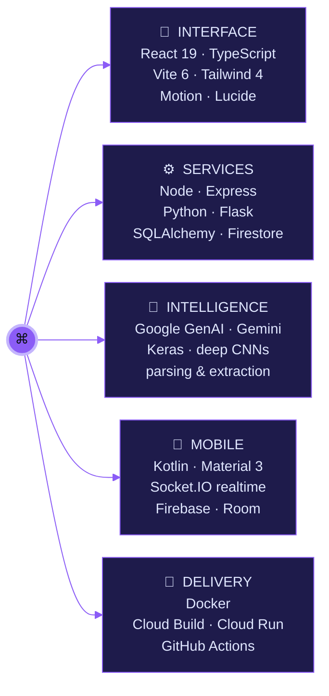
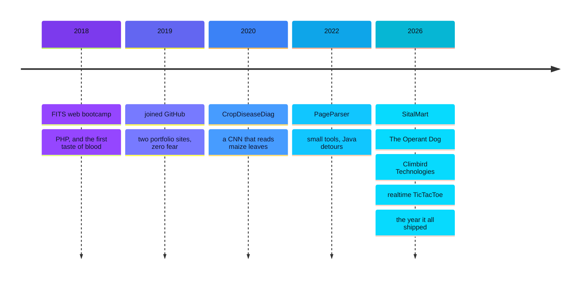

<div align="center">


</div>

```console
$ ssh prabesh@github.com --verbose

╭─────────────────────────────────────────────────────────────────────╮
│                                                                     │
│    ██████   ██████    █████   ██████   ███████  ███████  ██   ██    │
│    ██   ██  ██   ██  ██   ██  ██   ██  ██       ██       ██   ██    │
│    ██████   ██████   ███████  ██████   █████    ███████  ███████    │
│    ██       ██   ██  ██   ██  ██   ██  ██            ██  ██   ██    │
│    ██       ██   ██  ██   ██  ██████   ███████  ███████  ██   ██    │
│                                                                     │
│      full-stack engineer  ·  AI-shaped products  ·  since 2019      │
│                                                                     │
╰─────────────────────────────────────────────────────────────────────╯

[  OK  ] mounted   /dev/curiosity ......... size: unbounded
[  OK  ] started   react-19.service ....... typescript · vite · tailwind
[  OK  ] started   python.service ......... flask · keras · scrapers
[  OK  ] started   android.service ........ kotlin · firebase · socket.io
[  OK  ] started   genai.service .......... gemini · retrieval · agents
[ WARN ] detected  several unfinished side projects — this is normal
[  OK  ] reached target Shipping.

prabesh@github:~$ _
```

<div align="center">


</div>

---

## `$ cat /proc/self/status`

I build the whole thing — the pixel **and** the pipeline.

Interfaces that feel expensive, backends that don't fall over, and lately a lot of **Gemini-powered surfaces wired into real products** instead of demos. It started with a maize-leaf CNN in 2020, and I never really stopped pointing models at problems that belong to somebody.

```yaml
current_focus:
  - shipping client products at Climbird Technologies
  - React 19 + Vite 6 + Tailwind 4 as the default weapon
  - Google GenAI on production paths, not just in a chat box
  - realtime & offline-first mobile (Socket.IO + Room + Firestore)

ask_me_about:
  - making a "static" site do genuinely dynamic things
  - CNNs for agriculture, and why the dataset is always the hard part
  - dockerizing a Vite app onto Cloud Run without crying
```

---

## `$ tree ~/stack`



---

## `$ ls -lt ~/projects | head`

<table>
<tr>
<td width="50%" valign="top">

### 🐦 [Climbird Technologies](https://github.com/GPRABES/climbird-technologies)

A full agency platform — services, process, case studies, a Markdown blog pipeline built by parsing a PDF, and a Gemini-backed assistant. Containerized and shipped through Google Cloud Build.


</td>
<td width="50%" valign="top">

### 🐕 [The Operant Dog](https://github.com/GPRABES/the-operant-dog)

Brand site for operant-conditioning dog training, with an Express server in front and Google GenAI doing the talking. Motion-driven and deliberately calm — the opposite of a barking landing page.


</td>
</tr>
<tr>
<td width="50%" valign="top">

### ⭕ [TicTacToe](https://github.com/GPRABES/TicTacToe)

Three-in-a-row, taken absurdly seriously: **realtime online multiplayer** over Socket.IO, matchmaking plus 6-letter private rooms, Firebase auth, and Firestore↔Room sync so it keeps working offline. Ratings, match history, Material 3, animated, dark/light.


</td>
<td width="50%" valign="top">

### 🌽 [CropDiseaseDiag](https://github.com/GPRABES/CropDiseaseDiag)

Maize disease detection with a deep CNN — upload a leaf, get a diagnosis. Trained in Keras, served from Flask, deployed back when "ML in production" meant a `Procfile` and hope.


</td>
</tr>
<tr>
<td width="50%" valign="top">

### 🥬 [SitalMart](https://github.com/GPRABES/SitalMart)

A fruits-and-vegetables storefront: catalog, carts, accounts, forms, orders. Flask the honest way — no framework magic, just routes that do exactly what they say.


</td>
<td width="50%" valign="top">

### 📄 [PageParser](https://github.com/GPRABES/PageParser)

Tiny, sharp scraper. The kind of one-kilobyte script you write once and then quietly reuse for the next four years.


</td>
</tr>
</table>

---

## `$ git log --author=prabesh --reverse --oneline`

> Seven years of pushing to `main`.



---

## `$ htop`

<div align="center">

<picture>
  <source media="(prefers-color-scheme: dark)" srcset="https://github-profile-summary-cards.vercel.app/api/cards/profile-details?username=GPRABES&theme=github_dark" />
  
</picture>

<picture>
  <source media="(prefers-color-scheme: dark)" srcset="https://github-profile-summary-cards.vercel.app/api/cards/repos-per-language?username=GPRABES&theme=github_dark" />
  
</picture>
<picture>
  <source media="(prefers-color-scheme: dark)" srcset="https://github-profile-summary-cards.vercel.app/api/cards/most-commit-language?username=GPRABES&theme=github_dark" />
  
</picture>

<picture>
  <source media="(prefers-color-scheme: dark)" srcset="https://github-profile-summary-cards.vercel.app/api/cards/productive-time?username=GPRABES&theme=github_dark&utcOffset=5" />
  
</picture>

</div>

---

## `$ ./choose-your-path.sh`

> Pick one. They actually open.

<details>
<summary><b>🤝 &nbsp;I'm here to hire you</b></summary>

<br/>

You want someone who can take a vague idea to a deployed URL without needing three other people first. That's the job I keep doing.

- **Ship-shaped** — design → build → containerize → deploy, same pair of hands.
- **AI that earns its keep** — Gemini wired into real flows, not a floating chat bubble.
- **Range** — React product UI, Flask services, Kotlin apps, CNNs on real datasets.

📬 **[prabeshghimire82@gmail.com](mailto:prabeshghimire82@gmail.com)** — I answer.

</details>

<details>
<summary><b>🧑‍💻 &nbsp;I'm here to collaborate</b></summary>

<br/>

Especially interested in:

- **AI for agriculture** — the CropDiseaseDiag thread is unfinished business.
- **Realtime multiplayer** — matchmaking, presence, reconnection, all the fun bugs.
- **Absurdly polished small apps** — tiny scope, unreasonable quality.

Open an issue on any repo, or just start with a *"hey, what if…"*. Those work best.

</details>

<details>
<summary><b>🔍 &nbsp;I'm here to read the code</b></summary>

<br/>

Start here, in this order:

| repo | why |
| --- | --- |
| [TicTacToe](https://github.com/GPRABES/TicTacToe) | best README, hardest problems, offline-first architecture |
| [climbird-technologies](https://github.com/GPRABES/climbird-technologies) | a full product: routing, content pipeline, GenAI, Docker, Cloud Build |
| [CropDiseaseDiag](https://github.com/GPRABES/CropDiseaseDiag) | the ML origin story, `.h5` file and all |

</details>

<details>
<summary><b>🥚 &nbsp;I clicked this one on purpose</b></summary>

<br/>

```console
$ sudo make me a sandwich

[  OK  ] privileges escalated
[  OK  ] bread located
[ FAIL ] sandwich subsystem not installed

hint: my best commit message was "it works, don't ask"
hint: the maize model trained on a laptop hot enough to cook maize
hint: you read a profile README to the bottom. genuine respect.
```

</details>

---

## `$ man contact`

<div align="center">

<a href="mailto:prabeshghimire82@gmail.com"></a>
<a href="https://github.com/GPRABES"></a>
<a href="https://github.com/GPRABES?tab=repositories"></a>

<br/><br/>

```console
prabesh@github:~$ exit
Connection to github.com closed. see you in the commit log.
```

<sub>built by hand · no template was harmed · last recompiled 2026</sub>

</div>
